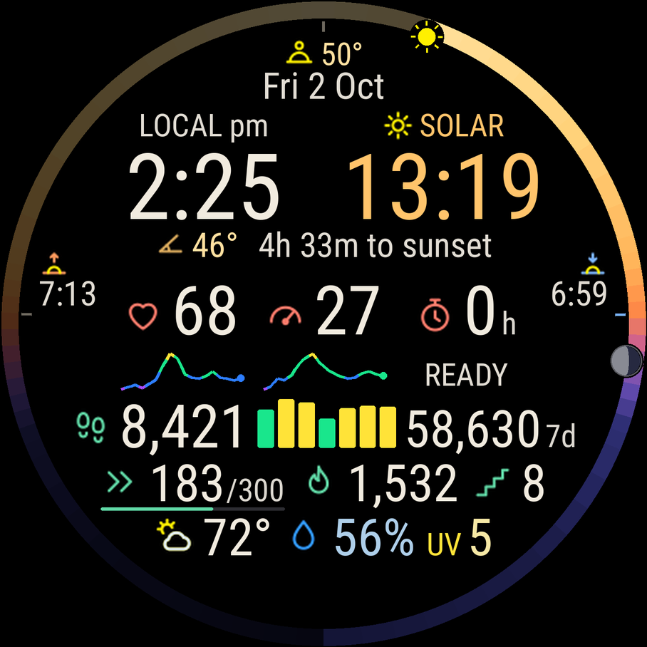

# SkyRing Garmin

A personal **Forerunner 965** watch face: a sky ring around a compact dashboard of activity, recovery, and weather. Built in Garmin Connect IQ / Monkey C for the 454 × 454 AMOLED display.

**October 6, 2026 candidate — dual clocks and weather rotation.** Local time and apparent solar time share the main header, with matching large numerals: warm-white local time on the left, amber solar time on the right. The owner liked the layout but reported that humidity/dew point still stopped alternating. This revision separates rotation state from drawing and adds a guarded two-second redraw timer during Garmin's permitted awake window. It preserves the selection through sleep and repeated callbacks. The candidate belongs on `candidate/dual-clock`; the working `main` release remains [0c16b2b](https://github.com/daveshap/SkyRingGarmin/commit/0c16b2bffc4aa3b430892c61db1ad82084a084a6). Watch validation of the rotation fix remains pending. [Rotation rationale and checks](docs/WEATHER_ROTATION_UPDATE.md) · [Header and build instructions](docs/DUAL_CLOCK_UPDATE.md).

SkyRing uses native, readable text; large icons beside numbers; fixed colors for recognition; bright small labels; and a black sleeping display. Data comes from Garmin's APIs and local astronomy calculations. There is no external account, API key, companion service, or always-on renderer.

  

Recreated illustrative preview from the candidate drawing methods and icon atlases. Desktop Roboto Condensed Regular substitutes for Garmin's native font; health/weather numbers are sample data. Astronomy uses October 2 at 2:25 p.m. EDT in Hillsborough, NC. This is not a Garmin simulator screenshot or the exact expired PNG.

## What is on the face

| Area | Information |
| --- | --- |
| Sky | Current Sun and Moon positions, phase-changing Moon disc, twilight/daylight ring, colorful sunrise/sunset times, solar time and altitude, next sun-event countdown, estimated daily peak solar altitude. |
| Body | Current heart rate and stress, their four-hour colored histories, native recovery hours. |
| Movement | Today's steps, seven daily step bars and their total, weekly intensity minutes against Garmin's goal, calories, floors climbed. |
| Weather | Colorful condition icon, temperature, optional high/low, alternating relative humidity/dew point, UV risk or rain probability. |

Clock and date follow the watch's settings. `7d` means **today plus the previous six local calendar dates**; `7d*` marks incomplete history. Weather is Garmin's cached observation. The Sun and colored ring follow **solar hour angle**. The Moon uses an **east/up/west projection**: east on the left, west on the right, above-horizon positions in the upper half, and below-horizon positions in the lower half. The rim is a compact sky view, not a calibrated altitude scale or compass. Marker brightness uses each body's separate horizon test.

## October 2 change: the Moon follows its own horizon

On September 30 at 10 a.m. in Hillsborough, the Moon calculation gave about **16.57° above the horizon**, but the old hour-angle mapping placed its icon almost at 3 o'clock. The correction changes the projection used to draw the Moon; it retains the existing coordinates and phase calculation. The Sun, daylight colors, sunrise/sunset, fonts, dashboard, and wake-only lifecycle are preserved. Astronomy still refreshes on wake and once per minute while awake, with no future-event search. [Method and test notes](docs/MOON_HORIZON_UPDATE.md).

## Retained September 28 changes

- **Recovery:** reads `ActivityMonitor.Info.timeToRecovery` directly in whole hours. Zero displays `0h` with **READY**; positive hours retain **RECOVERY**; unavailable data shows `--`. Recovery-minute complications, local countdowns, deliberate blanking, and wake retries are removed.
- **Weather icons:** lemon-yellow Sun and lightning; lavender Moon; silver clouds; blue rain; cyan snow; teal fog; mint wind. Compound icons have separate colored accents and silver cloud layers. The String comparison bug that bypassed these colors is fixed.
- **Humidity and dew point:** share a stable-width slot with distinct blue-droplet and violet thermometer/drop icons. The October 6 refactor preserves the displayed selection through refreshes, sleep, and repeated lifecycle callbacks. Normal frames and one guarded two-second timer advance the same rotation state. Missing either value stops the timer and leaves the available reading visible.
- **UV and contrast:** saturated UV labels follow standard risk categories, while their numbers are paler. Humidity, dew-point, and UV numbers blend 65% toward warm off-white. Rain probability replaces UV at 30% or higher.
- **Power behavior:** uses cached native weather and remains wake-only. The October 6 timer can request a redraw only after `onExitSleep()` permits it; hide, sleep, OFF, and LOW_POWER stop it. It does not fetch weather, extend the high-power window, or add an always-on renderer. Battery impact has not been measured.

See [release notes](docs/RELEASE_NOTES.md), [weather details](docs/WEATHER_UPDATE.md), [recovery rationale](docs/RAW_HOURS_UPDATE.md), and [the final polish](docs/POLISH_UPDATE.md) for the implementation and reasoning.

## Reading the histories

HR and stress traces show the previous four hours as 24 ten-minute averages, oldest on the left, and refresh about every five minutes while awake. Missing observations remain gaps; measured stress zero is valid. Current stress is read separately and is never copied into missing history.

| Color | Heart rate, BPM | Stress, rounded average |
| --- | --- | --- |
| Purple | Below 60 | 0–14 |
| Blue | 60–under 70 | 15–25 |
| Green | 70–under 90 | 26–50 |
| Yellow | 90–under 110 | 51–65 |
| Orange | 110–under 130 | 66–75 |
| Red | 130+ | 76–100 |

Chart heights scale to available readings; color thresholds stay fixed. These are display bands, not personalized heart-rate zones or sleep-stage detection. Each daily step bar is green below its recorded goal and yellow at or above it. An unavailable historical goal does not inherit today's goal.

**Simulator note:** the owner saw a blank stress trace in the SDK 9.2.0 simulator, then confirmed it worked on the watch. A [separate SDK 9.2.0 report](https://forums.garmin.com/developer/connect-iq/f/connect-iq-web-store/441912/emulator-sets-sensor-history-samples-time-into-future) describes future-dated stress samples, which SkyRing excludes. That is consistent with the symptom; the owner's simulator timestamps were not captured. No timestamp workaround is included.

## Build on Windows

Install Garmin's Connect IQ SDK and the FR965 device profile, Java 11 or newer, VS Code, and Garmin's Monkey C extension. Open the repository root, build for `fr965` with your developer key, and copy the resulting `.prg` into the watch's `GARMIN/APPS/` folder to sideload.

Use the [Windows setup and install guide](docs/BUILD_WINDOWS.md) for detailed steps. Keep the signing key outside the repository. Source and icon resources are included; no prebuilt watch binary is supplied. When upgrading an older ZIP, use a fresh folder so removed source files cannot remain in the build.

## Documentation

| Guide | Contents |
| --- | --- |
| [Weather rotation refactor](docs/WEATHER_ROTATION_UPDATE.md) | Reported stall, reproduced logic weaknesses, guarded scheduler, and remaining watch checks. |
| [Dual-clock candidate](docs/DUAL_CLOCK_UPDATE.md) | Side-by-side clock design, restoration, and installation. |
| [Release notes](docs/RELEASE_NOTES.md) | Changes, reasoning, release history, and rollback reference. |
| [Display guide](docs/DISPLAY_GUIDE.md) | Every icon, number, chart, color, data source, and missing-data rule. |
| [Weather update](docs/WEATHER_UPDATE.md) | Conditions, UV categories, dew point, String comparison fix, and rotation. |
| [Raw recovery hours](docs/RAW_HOURS_UPDATE.md) | Source choice, previous recovery failures, and vivid palette. |
| [Final polish](docs/POLISH_UPDATE.md) | Delayed-frame rotation fix, paler numbers, and READY caption. |
| [Architecture](docs/ARCHITECTURE.md) | Source map, lifecycle, refresh schedule, native APIs, permissions, and layout. |
| [Findings and limitations](docs/FINDINGS_AND_LIMITATIONS.md) | What worked, failed, or was removed, with remaining uncertainty. |
| [Sun and Moon calculations](docs/LUNAR_CALCULATIONS.md) | Time/location conventions, rim positions, phase, horizon shading, and accuracy. |
| [Moon horizon update](docs/MOON_HORIZON_UPDATE.md) | Why the old placement was misleading, the corrected projection, and validation limits. |
| [Windows build guide](docs/BUILD_WINDOWS.md) | Setup, simulator, signing, tests, and sideloading. |
| [Validation record](docs/VALIDATION.md) | Owner acceptance, build checks, host regression results, and historical investigations. |

## Scope and validation

The owner authorized publication of the working version on October 2. The September 30 Moon candidate had passed generic SDK compilation, with 30 native test functions compiled, plus source-derived regression and full-day motion checks. The current restoration and publication checks are recorded in [VALIDATION.md](docs/VALIDATION.md). Host checks do not execute Garmin's VM; FR965 runtime margin, battery life, and exhaustive firmware behavior have not been measured.

Current Sun/Moon position and lunar phase remain. Moonrise/moonset and next-full/new-moon dates remain removed, along with the event-search machinery that caused a watchdog crash and unreliable loading fields. The former battery/weather-age/elevation footer is removed to give priority to the remaining readings. Floors climbed stays.

HRV, sleep data, VO2 max, exercise load, acclimation, and chest-strap connection state are not displayed. Body Battery, SpO2, and respiration are deliberately absent. The findings guide records the decisions and API caveats.

The project targets only `fr965` and declares minimum API 4.2.0. Other devices and languages have not been validated.

## Repository contents

`source/` holds the Monkey C modules; `resources/` contains the launcher and icon atlases; `tests/` contains native regression tests. Text uses Garmin's native fonts; the bitmap resources contain icons only.

`tools/check_candidate.js` checks source-derived helper and lifecycle logic; `tools/check_weather.js` checks weather drawing with distinct string objects, rotation, and the prior color-selection failure; `tools/check_weather_rotation.js` reproduces the prior callback reset and exercises monotonic state plus timer/lifecycle wiring; `tools/check_rim_positions.js` checks astronomy arithmetic and the Moon's horizon-aware projection. These host checks run outside Garmin's VM. `tools/gen_icons.py` regenerates icons when needed; normal builds use the committed resources. `monkey.jungle` builds the face; `monkey-tests.jungle` adds native tests.
