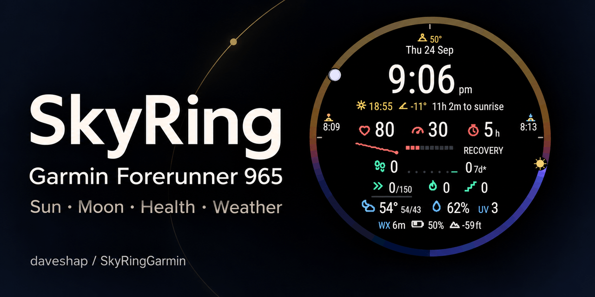

# Repository social preview



The PNG is 1280 × 640 pixels (2:1), with an opaque background and a file size below 1 MB. It was generated using the built-in image-generation tool with [the current screen export](../SkyRing%20Final.png) as a visual reference, then resized and losslessly encoded for upload. This is promotional artwork; the README embeds the original, unmodified screen export.

To activate it, open the repository's **Settings → General → Social preview → Edit → Upload an image**, then select [skyring-social-preview.png](images/skyring-social-preview.png). Committing the file does not automatically change GitHub's social-preview setting.

See [GitHub's social-preview documentation](https://docs.github.com/en/repositories/managing-your-repositorys-settings-and-features/customizing-your-repository/customizing-your-repositorys-social-media-preview).

## Generation prompt

```text
Use case: compositing
Asset type: GitHub repository social preview, exact 2:1 landscape canvas, 1280 by 640 pixels.
Primary request: Create a polished, restrained project preview card for SkyRing, a Garmin Forerunner 965 watch face.
Input image 1: actual current SkyRing watch-face screen export. Use as the product visual, preserve the entire screen design and its actual native typography, exact numeric readings, icons, ring, Sun and Moon positions. Do not redesign or add widgets.
Scene/backdrop: opaque almost-black background with a very subtle midnight-blue falloff, crisp rather than hazy. A single faint gold orbital arc may echo the product ring, but keep the composition uncluttered.
Composition: generous 64-pixel safe margins. Left half is typography, right half features the complete circular watch-face export, roughly 480 pixels diameter, on black seamlessly blended into the background. No physical watch case or wrist; the screen itself is the hero. Keep the entire circle within the frame. Beautiful deliberate whitespace and clear hierarchy.
Text, verbatim:
"SkyRing"
"Garmin Forerunner 965"
"Sun · Moon · Health · Weather"
"daveshap / SkyRingGarmin"
Typography: SkyRing large clean refined sans-serif, off-white, normal to medium weight, not heavy, no novelty font. Device line smaller off-white; feature line subdued but readable warm gray. Repository name small at lower left. All text must be spelled exactly, no extra slogan.
Color palette: warm off-white, midnight black, restrained gold and blue accents, retain coral and mint within the supplied watch face.
Constraints: produce exactly 2:1 landscape. Preserve actual screenshot inside the circular face, no altered, fabricated, warped, or nonsensical readings. No gradients inside text, no fake GitHub logos, no watermark, no stars/nebula/cosmic clutter, no tiny unreadable marketing prose. This is a tasteful real software project card, not a science-fiction poster.
```
